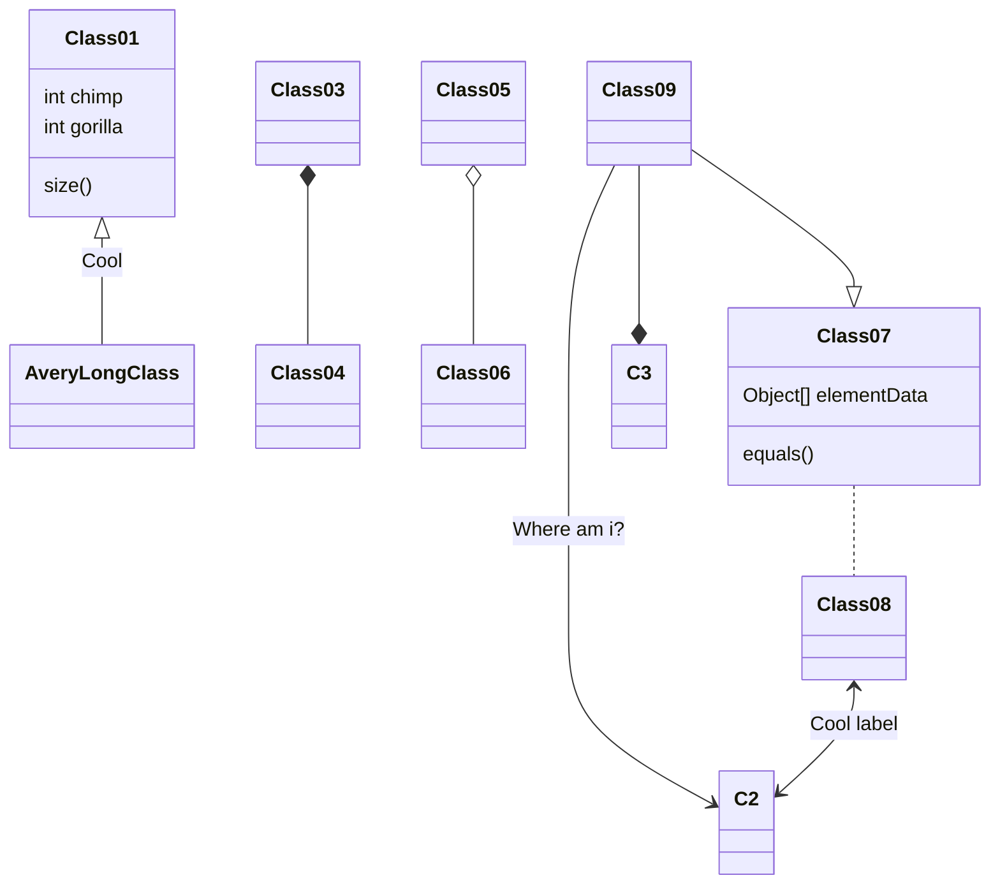
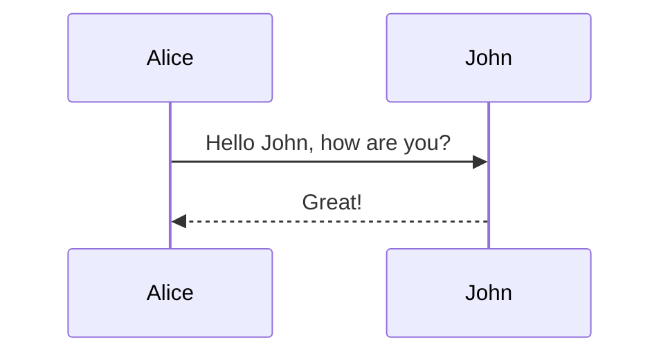
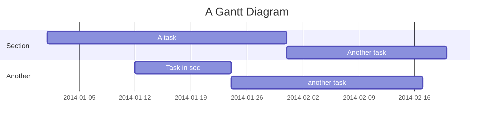
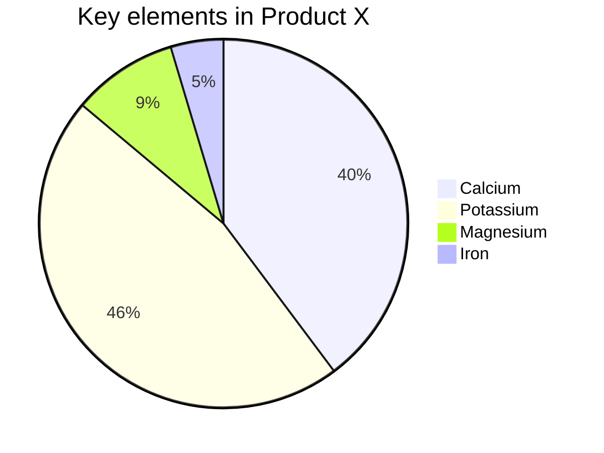
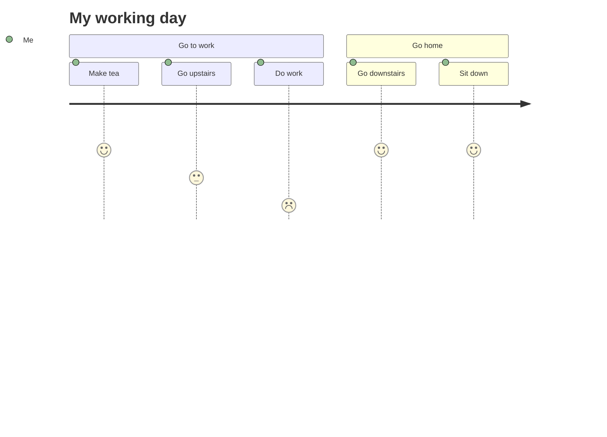

```mermaid
flowchart LR
    id1(Box with round corner)
    id2([Stadium])
    id3[(Database)]
    id4((Circle))
    id5{{Hex}}
    id6[\Parallelogram\]
    id7[\Trapezoid/]

    id1-- 1st line ---id2
    id1--> |2nd line| id3
    id1--- |3rd line| id4
    id2-.-|4th line| id5
    id3 == 5th line ==> id6
    id4 <--> id7 --> id6

    style id1 fill:green,stroke:black
    style id2 fill:white,stroke:#f66,stroke-dasharray: 5, 5,color:black
    style id3 fill:#66f,stroke:#f6f,stroke-width:4px
    style id4 fill:red,stroke:yellow
    style id5 fill:orange,stroke:white,color:black
    style id6 fill:yellow,stroke:blue,color:black
    style id7 fill:brown,stroke:blue
````


```mermaid
graph TD
    A[Christmas] -->|Get money| B(Go shopping)
    B --> C{Let me think}
    C -->|One| D[Laptop]
    C -->|Two| E[iPhone]
    C -->|Three| F[Car]
```









    
    ```mermaid
    stateDiagram-v2
    [*] --> Still
    Still --> [*]
    Still --> Moving
    Moving --> Still
    Moving --> Crash
    Crash --> [*]
    ```
        
        ```mermaid
        stateDiagram
        [*] --> Still
        Still --> Moving
        Moving --> Still
        Moving --> Crash
        Crash --> [*]
        ```
        
        ```mermaid
        stateDiagram
        [*] --> Still
        Still --> Moving
        Moving --> Still
        Moving --> Crash
        Crash --> [*]
        ```
        
        