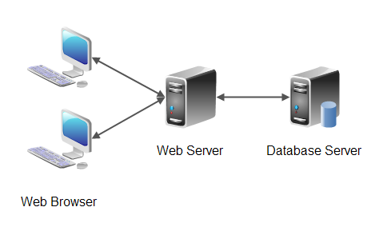
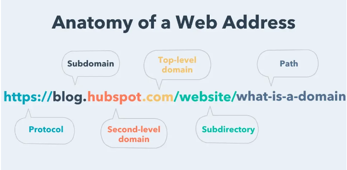
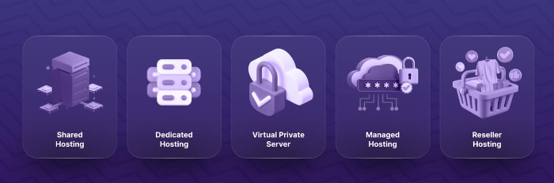
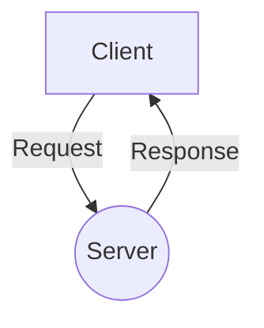
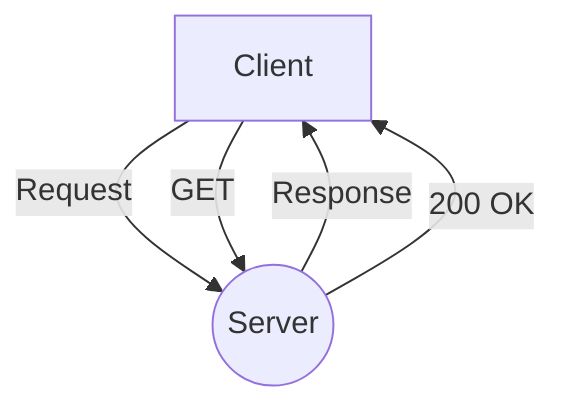
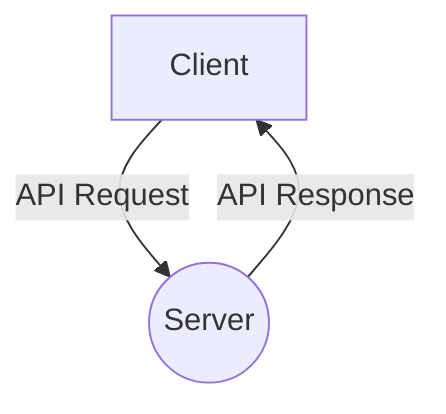

# Wellcome to Back-End Web Development
## Class 1
###  Agenda
#### 1. Introduction to Web Development
#### 2. How the Web Works
#### 3. Introduction to Back-End Web Development


### Introduction to Web Development in Points
1. web development is process of building,mantaining,optimazing  websites and web applications for the internet.

2. Web development is divided into two parts:
    - Front-End Development
    - Back-End Development


### There are  main components of the web:
1. **Client**: The client is the user's computer, also known as the user agent. It could be a desktop computer, a mobile device, or any other device that can access the web.
2. **Server**: The server is a computer that stores the website's files and serves them to the client when requested.
3. **Database**: The database is a collection of data that is stored on the server. It is used to store and retrieve information for the website or web application.
4. **Front-End**: The front-end is the part of the website that the user interacts with. It is built using HTML, CSS, and JavaScript.
5. **Back-End**: The back-end is the part of the website that the user does not see. It is responsible for processing data, managing the database, and handling requests from the client.


# How the Web Works
1. Each website has a unique address called a URL (Uniform Resource Locator).
2. When a user enters a URL into their browser, the browser sends a request to the server for the website's files.
3. The server processes the request and sends the files back to the client.
4. The client's browser then renders the files and displays the website to the user.

```yaml
See the image below for a visual representation of how the web works:
```


# lets Explain each stage/steps of the working of web

1. **User Enters URL**:
   - The user enters a URL into their browser's address bar and hits enter like `https://www.google.com`.
2. **Browser Sends Request**:
   - The browser sends a request to the server for the website's files using HTTP (Hypertext Transfer Protocol).
3. **Server Processes Request**:
   - The server processes the request and retrieves the website's files from the file system or database(Back-End).
4. **Server Sends Files**: 
   - The server sends the files back to the client's browser using HTTP.
1. **Browser Renders Files**: 
   -  The client's browser renders the files and displays the website to the user.
2. **User Interacts with Website**: 
   - The user interacts with the website by clicking on links, filling out forms, and performing other actions.
3. **Client Sends Data to Server**:
   - The client sends data to the server by submitting forms, making API requests, or interacting with the website in other ways in the form of HTTP request and data is foromated in JSON or XML.
4. **Server Processes Data**:
   - The server processes the data, updates the database, and sends a response back to the client.
5. **Client Receives Response**: 
   - The client receives the response from the server and renders it in the browser.
6.  **Website Updates**:
    - The website updates in real-time based on the user's actions and the data stored in the database.
7.  **User Leaves Website**:
    - The user leaves the website by closing the browser tab or navigating to a different URL.
8.  **Session Ends**: 
    - The session between the client and server ends, and the website is no longer active.
9.  **Website Files Stored**:
    - The website's files are stored on the server and can be accessed by other users in the future.
10. **Website Data Stored**:
    - The website's data is stored in the database and can be retrieved and updated by the server as needed.

```yaml
The web works in a continuous loop of requests and responses between the client and server, allowing users to interact with websites and web applications in real-time.
```
---
# What is https://www.google.com
- **https**:
  -  Hyper Text Transfer Protocol Secure(https is a secure version of http, which is the protocol used to transfer data between a web browser and a website. The 's' at the end of https stands for 'secure'. It means all communications between your browser and the website are encrypted.)
- **www**: World Wide Web(www is a subdomain of the domain name. It is used to identify the server that hosts the website. In this case, the server is hosting the website for the World Wide Web.)
- **google**: Domain Name (google is the domain name of the website. It is used to identify the website on the internet.)
- **com**: Top-Level Domain (com is the top-level domain of the website. It is used to identify the type of organization or entity that owns the website. In this case, com stands for commercial.)

# An Other Example of a URL is https://www.babarai.com/login
- **https**: Hyper Text Transfer Protocol Secure
- **www**: World Wide Web
- **babarai**: Domain Name
- **com**: Top-Level Domain
- **login**: Path (login is the path to a specific page on the website. It is used to identify the location of the page within the website's file structure.)

```yaml
URLs are used to identify and locate websites and web pages on the internet. They consist of a protocol, subdomain, domain name, top-level domain, and optional path.
```

---
# if our data stored in database then working flow?
```yaml
If the data is stored in a database, the working flow of the web is as follows:
```
 

---
# What is domain and how it works?
- **Domain**:
  - A domain is a human-readable address that is used to identify a website on the internet. It consists of a domain name and a top-level domain (TLD), such as .com, .org, or .net. For example, in the URL https://www.google.com, "google" is the domain name, and "com" is the TLD.
- **How it Works**:
  - When a user enters a domain name into their browser's address bar, the browser sends a request to a domain name system (DNS) server to translate the domain name into an IP address. The DNS server then returns the IP address of the server that hosts the website. The browser then sends a request to the server for the website's files, and the server responds by sending the files back to the browser. The browser then renders the files and displays the website to the user.
 -  **Types of Domain**:
    - **Top-Level Domain (TLD)**: The top-level domain is the last part of a domain name, such as .com, .org, or .net. It is used to identify the type of organization or entity that owns the website.
    - **Second-Level Domain (SLD)**: The second-level domain is the part of the domain name that comes before the top-level domain, such as "google" in google.com. It is used to identify the website or organization.
    - **Subdomain**: A subdomain is a domain that is part of a larger domain, such as "www" in www.google.com. It is used to identify a specific server or section of a website.

```yaml
Domains are used to identify websites on the internet and make it easier for users to access websites using human-readable addresses.
```

---
# What is Hosting and how it works?
- **Hosting**: Hosting is the process of storing a website's files on a server and making them accessible to users on the internet. Web hosting companies provide servers that store website files and serve them to users when requested.
- **How it Works**: When a user enters a domain name into their browser's address bar, the browser sends a request to the hosting server for the website's files. The hosting server processes the request and sends the files back to the browser, which renders them and displays the website to the user. Hosting servers are connected to the internet and have high-speed connections to ensure fast and reliable access to websites.

- **Types of Hosting**:
  - **Shared Hosting**: Shared hosting is a type of hosting where multiple websites share the same server and resources. It is a cost-effective option for small websites and blogs.
  - **VPS Hosting**: VPS hosting is a type of hosting where a virtual private server is created on a physical server. It provides more control and customization options than shared hosting.
  - **Dedicated Hosting**: Dedicated hosting is a type of hosting where a single server is dedicated to a single website or organization. It provides the highest level of performance and security.
  - **Cloud Hosting**: Cloud hosting is a type of hosting where website files are stored on multiple servers in the cloud. It provides scalability and reliability by distributing resources across multiple servers.



```yaml
Hosting is essential for making websites accessible to users on the internet. It involves storing website files on a server and serving them to users when requested.
```


---
# What HTTP and how it works?
- **HTTP**: 
  - HTTP stands for Hypertext Transfer Protocol. It is the protocol used to transfer data between a web browser and a website. HTTP defines how 
  - messages are formatted and transmitted, and how web servers and browsers should respond to various commands.
  - It can access(html,css,js,img and other files ) and send data to server in the form of JSON or XML.
  
- **How it Works**:
  - It work based on Http Methods
    - get : The GET method is used to request data from a server. It is used to retrieve data from a specified resource.
    - post : The POST method is used to submit data to a server to create or update a resource.
    - put : The PUT method is used to update or replace an existing resource on the server.
    - delete : The DELETE method is used to delete a resource from the server.
    - patch : The PATCH method is used to apply partial modifications to a resource.
    - head : The HEAD method is similar to the GET method, but it only returns the headers of the response without the body.
    - options : The OPTIONS method is used to describe the communication options for the target resource.
    - trace : The TRACE method is used to perform a message loop-back test along the path to the target resource.
    - connect : The CONNECT method is used to establish a tunnel to the server identified by the target resource.
    - 

```yaml
---
```
# now working flow  https method using mermaid

```yaml
---
```

# There are 100 to 599 status code in http method
 - these status code are divided into 5 categories
   - 1xx: Informational - Request received, continuing process 100 to 199
   - 2xx: Success - The action was successfully received, understood, and accepted 200 to 299
   - 3xx: Redirection - Further action must be taken in order to complete the request 300 to 399
   - 4xx: Client Error - The request contains bad syntax or cannot be fulfilled 400 to 499
   - 5xx: Server Error - The server failed to fulfill an apparently valid request 500 to 599


# Example of status code
**Informational**:
  - 100 Continue (The server has received the request headers and the client should proceed to send the request body)
  - 101 Switching Protocols (The requester has asked the server to switch protocols and the server has agreed to do so)
  - 102 Processing (WebDAV; RFC 2518) (A WebDAV request may contain many sub-requests involving file operations, requiring a long time to complete the request)

**Success**:
    - 200 OK (The request is successful)
    - 201 Created (The request has been fulfilled and has resulted in one or more new resources being created)
    - 202 Accepted (The request has been accepted for processing, but the processing has not been completed)
    - 204 No Content (The server successfully processed the request and is not returning any content)

**Redirection**:
    - 300 Multiple Choices (The request has more than one possible response)
    - 301 Moved Permanently (The URL of the requested resource has been changed permanently)
    - 302 Found (The URL of the requested resource has been changed temporarily)
    - 304 Not Modified (The resource has not been modified since the last request)
    - 307 Temporary Redirect (The request should be repeated with another URL)
    - 308 Permanent Redirect (The request and all future requests should be repeated using another URL)

**Client Error**:
    - 400 Bad Request (The request cannot be fulfilled due to bad syntax)
    - 401 Unauthorized (The request requires user authentication)
    - 403 Forbidden (The server understood the request but refuses to authorize it)
    - 404 Not Found (The server has not found anything matching the requested URL)
    - 405 Method Not Allowed (The method specified in the request is not allowed)
    - 408 Request Timeout (The server timed out waiting for the request)
    - 429 Too Many Requests (The user has sent too many requests in a given amount of time)

**Server Error**:
    - 500 Internal Server Error (The server encountered an unexpected condition that prevented it from fulfilling the request)
    - 501 Not Implemented (The server does not support the functionality required to fulfill the request)
    - 502 Bad Gateway (The server received an invalid response from the upstream server)
    - 503 Service Unavailable (The server is currently unavailable)
    - 504 Gateway Timeout (The server did not receive a timely response from the upstream server)
    - 505 HTTP Version Not Supported (The server does not support the HTTP protocol version used in the request)

```yaml
HTTP status codes are used to indicate the success or failure of an HTTP request. They are divided into categories based on the type of response.
```

---

# what is API and how it works?
- **API**:
  - API stands for Application Programming Interface. It is a set of rules and protocols that allow different software applications to communicate with each other. APIs define the methods and data formats that applications can use to request and exchange information.
  - APIs are used to access data from a server, send data to a server, or perform specific actions on a server. They are commonly used in web development to integrate different systems and services.
  - APIs can be used to access data from a database, retrieve information from a website, or interact with a web service. They can be accessed using HTTP requests and data is formated in JSON or XML.
  - APIs are used to access data from a server, send data to a server, or perform specific actions on a server. They are commonly used in web development to integrate different systems and services.
  

- **How it Works**:
- **API Request**:
  - The client sends an API request to the server using HTTP. The request includes the API endpoint, method, headers, and data.
  - **API Endpoint**: The API endpoint is the URL where the API request is sent. It specifies the location of the resource or action that the client wants to access.
  - **API Method**: The API method is the HTTP method used in the request, such as GET, POST, PUT, DELETE, etc.
  - **API Headers**: The API headers contain additional information about the request, such as authentication tokens, content type, and accept type.
  - **API Data**: The API data is the payload of the request, which can include parameters, query strings, or a request body.
  - **API Response**: The server processes the API request and sends a response back to the client. The response includes the status code, headers, and data.
  - **API Status Code**: The API status code indicates the success or failure of the request. It is a three-digit number that provides information about the response.
  - **API Headers**: The API headers contain additional information about the response, such as content type, cache control, and cookies.
  - **API Data**: The API data is the payload of the response, which can include data, error messages, or other information.
  - **API Integration**: The client integrates the API response into its application, processes the data, and displays it to the user.
  - **API Error Handling**: The client handles any errors or exceptions that occur during the API request and response process.
  - **API Security**: The client ensures that the API request and response are secure by using encryption, authentication, and other security measures.
  - **API Documentation**: The client refers to the API documentation to understand how to use the API, including the endpoints, methods, parameters, and data formats.
  - **API Testing**: The client tests the API request and response to ensure that it works as expected and handles different scenarios.
  - **API Versioning**: The client uses API versioning to manage changes to the API over time and ensure backward compatibility with existing applications.
  - **API Rate Limiting**: The client implements rate limiting to prevent abuse of the API and ensure fair usage by all users.
  - **API Caching**: The client caches API responses to improve performance and reduce the load on the server.
  - **API Monitoring**: The client monitors the API request and response to detect issues, errors, and performance problems.
  - **API Scaling**: The client scales the API to handle increasing traffic, requests, and data volume as the application grows.
#  working flow of API 

#  Type of API
- **REST API**: REST (Representational State Transfer) is an architectural style for designing networked applications. It defines a set of constraints that a system must adhere to in order to be considered RESTful. RESTful APIs are designed to be simple, lightweight, and scalable.
- **SOAP API**: SOAP (Simple Object Access Protocol) is a protocol for exchanging structured information in the implementation of web services. It is based on XML and is used to define the message format and communication protocol between web services.
- **GraphQL API**: GraphQL is a query language for APIs and a runtime for executing those queries. It provides a more flexible and efficient way to request and update data from a server compared to traditional REST APIs.
- **JSON API**: JSON API is a specification for building APIs in JSON. It defines a set of rules for how data should be formatted and transmitted between the client and server. JSON APIs are designed to be easy to use, consistent, and efficient.

- **Microservices API**: Microservices APIs are APIs that are designed to work with microservices architectures. They are used to define the communication between different microservices in a distributed system. Microservices APIs are designed to be flexible, scalable, and resilient.
```yaml
APIs are used to access data from a server, send data to a server, or perform specific actions on a server. They define the methods and data formats that applications can use to communicate with each other.
```


# Introduction to Back-End Web Development

- **Back-End Web Development**:
  - Back-end web development is the process of building and maintaining the server-side of a website or web application. It involves working with databases, servers, and application logic to process data, manage resources, and handle requests from the client.
  - Back-end developers are responsible for implementing the business logic of a website or web application, managing the database, and handling user authentication and authorization. They work closely with front-end developers to ensure that the website functions correctly and provides a seamless user experience.
  - Back-end web development is an essential part of web development, as it enables websites and web applications to store and retrieve data, process user input, and interact with external services and APIs.

- **Skills Required for Back-End Web Development**:
- **Programming Languages**: Back-end developers should be proficient in programming languages such as JavaScript, Python, Ruby, PHP, Java, or C#.
- **Databases**: Back-end developers should have experience working with databases such as MySQL, PostgreSQL, MongoDB, or Redis.
- **Server-Side Frameworks**: Back-end developers should be familiar with server-side frameworks such as Node.js, Django, Ruby on Rails, Laravel, or Spring.
- **API Development**: Back-end developers should have experience building and consuming APIs using REST, SOAP, GraphQL, or JSON.
- **Authentication and Authorization**: Back-end developers should understand how to implement user authentication and authorization using techniques such as OAuth, JWT, or sessions.
- **Security**: Back-end developers should be familiar with security best practices, such as encryption, input validation, and protection against common security vulnerabilities.
- **Testing**: Back-end developers should know how to write unit tests, integration tests, and end-to-end tests to ensure the reliability and performance of their code.    
- **Version Control**: Back-end developers should be proficient in using version control systems such as Git to manage and collaborate on code.
- **Deployment**: Back-end developers should know how to deploy their code to production servers, monitor performance, and troubleshoot issues in a live environment.
- **Agile Development**: Back-end developers should be familiar with agile development methodologies, such as Scrum or Kanban, to work collaboratively with other team members and deliver high-quality software.

```yaml
Back-end web development is the process of building and maintaining the server-side of a website or web application. It involves working with databases, servers, and application logic to process data, manage resources, and handle requests from the client.
```

---
# Conclusion
- In this class, we learned about web development, how the web works, and the basics of back-end web development. We explored the components of the web, including the client, server, database, front-end, and back-end. We discussed the working flow of the web, including how a user interacts with a website, how data is stored in a database, and how HTTP requests and responses are used to communicate between the client and server. We also learned about domains, hosting, APIs, and the skills required for back-end web development. Back-end web development is an essential part of web development, as it enables websites and web applications to store and retrieve data, process user input, and interact with external services and APIs. In the next class, we will dive deeper into back-end web development and explore different server-side technologies, frameworks, and tools used in the industry.
- **Key Takeaways**:
  - Web development is the process of building, maintaining, and optimizing websites and web applications for the internet.
  - The web is made up of components such as the client, server, database, front-end, and back-end.
  - The web works by sending requests and responses between the client and server using HTTP.
  - Domains are human-readable addresses used to identify websites on the internet.
  - Hosting is the process of storing website files on a server and making them accessible to users on the internet.
  - HTTP is the protocol used to transfer data between a web browser and a website.
  - APIs are used to access data from a server, send data to a server, or perform specific actions on a server.
  - Back-end web development involves building and maintaining the server-side of a website or web application.
  - Back-end developers should have skills in programming languages, databases, server-side frameworks, API development, authentication, security, testing, version control, deployment, and agile development.

```yaml
In the next class, we will dive deeper into back-end web development and explore different server-side technologies, frameworks, and tools used in the industry.
```
---
#   Thank You
```yaml
Thank you for attending this class on Introduction to Web Development and Back-End Web Development. We hope you found the information useful and informative. If you have any questions or feedback, please feel free to reach out to us. We look forward to seeing you in the next class. Have a great day!
```
```yaml
---
```